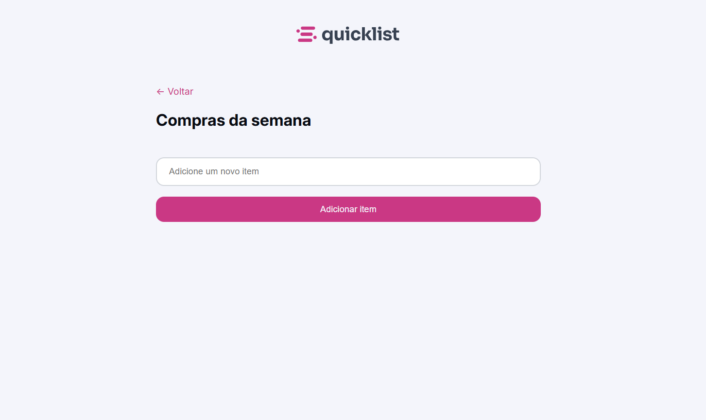

# Quicklist

Quicklist is a simple shopping list web application created to practice DOM manipulation, event handling, and interface styling using JavaScript, HTML, and CSS.

Users can add items to the list, mark products as completed, and remove elements dynamically.

---

## 🚀 Technologies Used

- HTML5
- CSS3
- JavaScript
- Figma

---

## 🎯 Features

- Add new items
- Mark items as completed
- Remove items from the list
- Simple and responsive interface
- Dynamic DOM manipulation

---

## 📸 Preview

